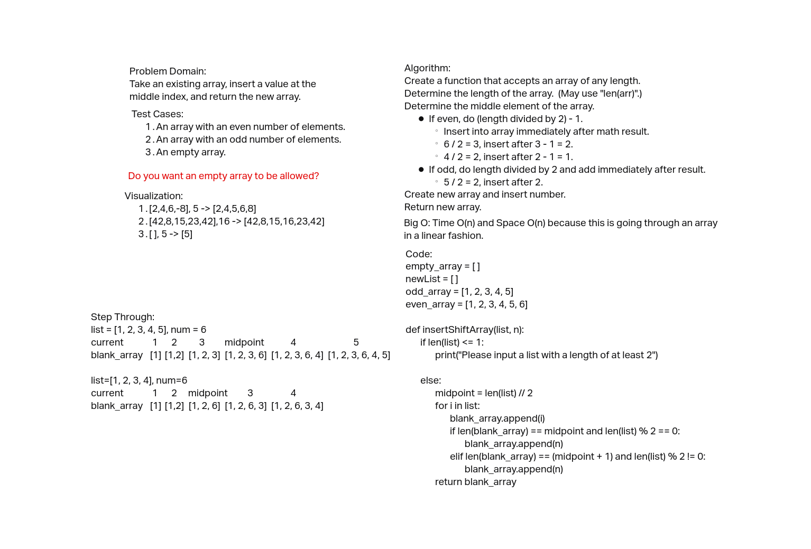

# Insert to Middle of an Array
Create a function to insert a value into the middle of an array and return
the new array.

## Whiteboard Process

## Approach & Efficiency
The approach taken was find the length of the existing array, then divide it
by 2, then use a for loop to append each element of the existing array into
a new array until the midpoint was reached.  When the midpoint was reached,
if the number of elements was even, the new number was inserted.  If the
midpoint was odd, one more element of the existing array was appended prior
to the insertion of the new number.  The for loop then continued to append
the remaining elements of the existing array.

Big O: Space --> O(n) and Time --> O(n) because this program goes through an
array in a linear fashion and contains a single for loop.

### Partner: Anthony Turinski
