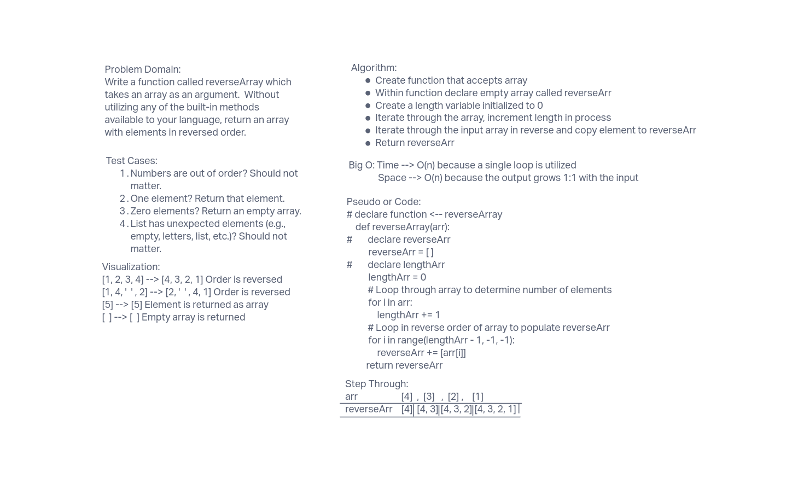

# Reverse an Array
Write a function called reverseArray which takes an array as an argument.
Without utilizing any of the built-in methods available to your language,
return an array with elements in reversed order.

## Whiteboard Process

## Approach & Efficiency
The approach taken was to determine the length of the input array using a
for loop, then use the length to go through the input array in reverse order
and transfer it to the reverse array.  This approach was taken because
built-in methods were not to be used, so it was interpreted that using len()
was not allowed.

Big O: Space --> O(n) because there is a 1:1 ratio of the size of the input
with the output. 
Time --> O(n) because there is a single loop that is dependent on the number
of elements in the loop.
