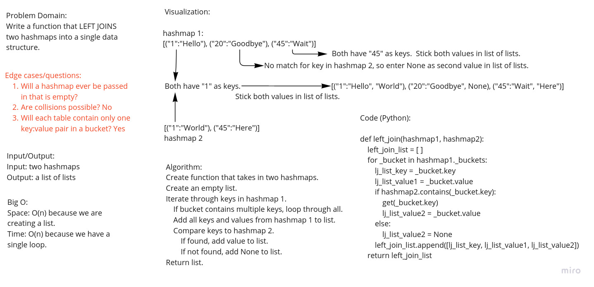

# Hashmap LEFT JOIN
### Worked with Jacob Amsbury and Sergii Otryshko

## Challenge
Write a function that LEFT JOINs two hashmaps into a single data structure.

## Approach & Efficiency
### Approach
The approach that was taken was to create the whiteboard, including code,
then copy the code to an IDE and modify it as needed to get it to work.
This was done in a mob programming manner.

### Efficiency
Big O:
Space: O(n) because we created a new data structure in the form of a list.
Time: O(n) because we have a single loop.

## Solution

