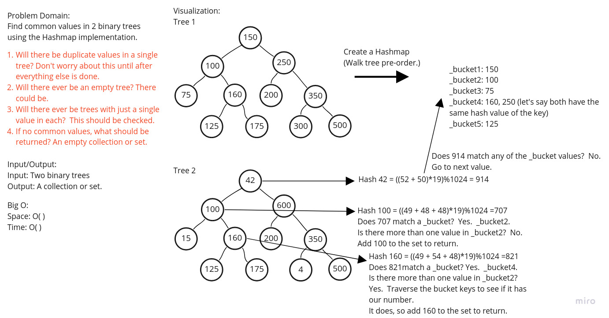
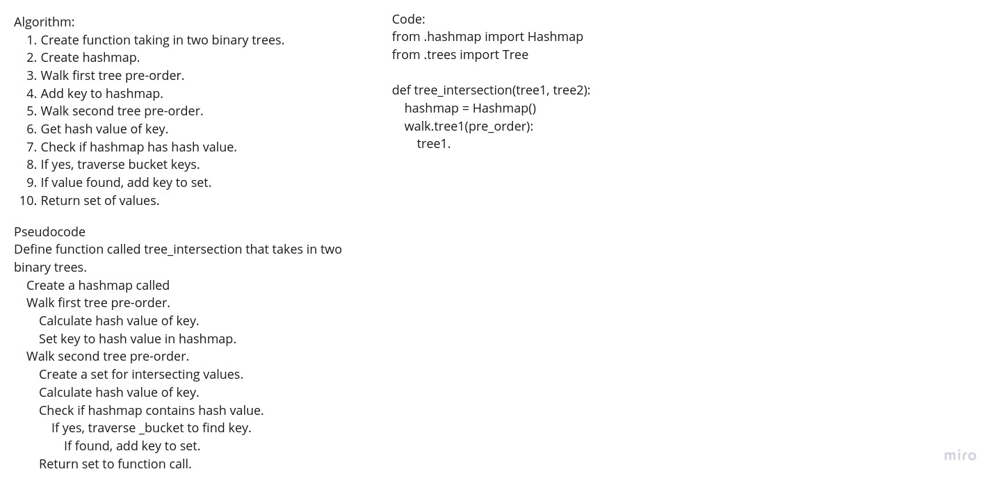

# Tree Intersection

## Challenge
The challenge was to write a function that would find the common values in
two binary trees.

## Whiteboard Process

## Approach & Efficiency
#### Approach
The approach that was taken with this assignment was to create a whiteboard
and then write code based off of that whiteboard.  After the code was
written, tests were written to verify the code worked as intended.

#### Efficiency
Big O of Time: O( )

Big O of Space: O( )

## API
__tree_intersection__: Finds the common values in two binary trees and
returns them as a set.
