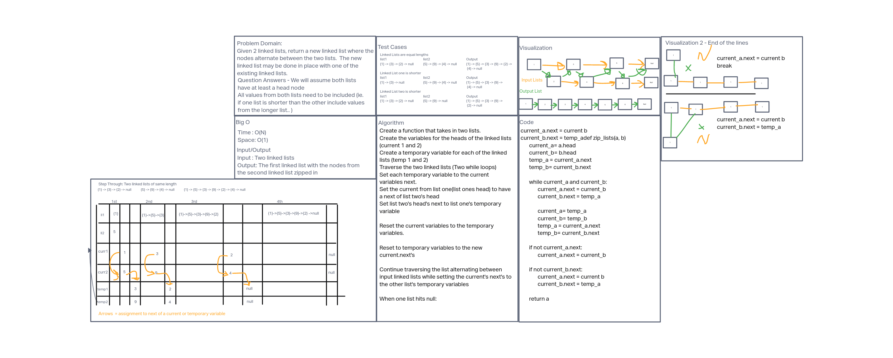

# Singly Linked List
A singly linked list is a collection of nodes that contain a value and know
the next node in the sequence.

## Challenge
The challenge was to create a Node class, create a Linked List class, and
add methods to the Linked List class for insert, includes, and to string.
These are detailed below in the API section.

## Approach & Efficiency
The approach that was taken was to write a segment of code first and then
write a test to check that segment.  This was done because I was unaware of
where the pre-written tests were located.  After I was shown where they were,
I went back and checked that I still passed each test.  If a test was not
passed, I did troubleshooting with the code and fixed the issue.  All tests
in all test files pass.

Big O: 
Space: O(1) because a singly linked list grows linearly as new elements are
added.
Time: O(n) because the singly linked list is traversed via a while loop.

## API
* __\_\_str\_\_(self)__: Refers back to the to_string() method.
* __insert(self, value)__: Allows insertion of a new node at the start of the
  head of the Linked List.
* __includes(self, value)__: Allows checking that a value is within a node
  of the Linked List.
* __to_string(self)__: Returns a list of all of the values contained in the
  Linked List with arrows separating them.  Ex: { a } -> { b } -> { c } -> NULL
* __append(self)__: Adds a node to the end of a Linked List.
* __insert_before(self, search_value, new_value)__: Adds a node before the
  first value that matches the search value.
* __insert_after(self, search_value, new_value)__: Adds a node after the
  first value that matches the search value.
* __insert_before_empty(self, search_value, new_value)__: Runs insert_before
  if not an empty Linked List.  If empty Linked List, raises TargetError
  (Exception).
* __insert_before_missing(self, search_value, new_value)__: Runs
  insert_before if search value is found.  If search value not found, raises
  TargetError(Exception).
* __insert_after_empty(self, search_value, new_value)__: Runs insert_after
  if not an empty Linked List.  If empty Linked List, raises TargetError
  (Exception).
* __insert_after_missing(self, search_value, new_value)__: Runs
  insert_after if search value is found.  If search value not found, raises
  TargetError(Exception).
* __zip_lists(a, b)__: Takes two Linked Lists and combines them in
  alternating order.  If either Linked List is empty, returns the existing
  Linked List.

### Whiteboard

#### Worked with JJ Escandor, Jae Loney, Joey Marianer, Justin Hamerly (TA), and Tammy Do (TA)
