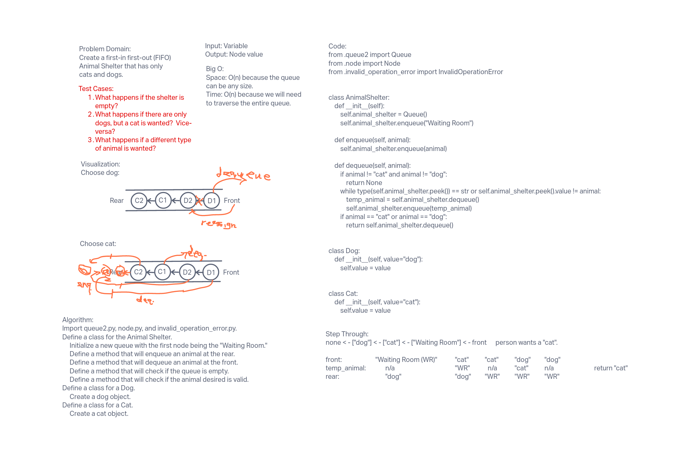

## Challenge
The challenge was to create a queue that would take in animals (dogs and cats)
and then remove the first animal of the type desired.

## Approach & Efficiency
The approach taken was to write an algorithm utilizing the previous queue2.
py file that had been created with the enqueue, dequeue, peek, and is_empty
methods.  That file was then copied, along with the node.py and
invalid_operation_error files into the stack_queue_brackets directory.  With
the files all in the correct locations, the algorithm was then converted
into code and tested.

Big O:
* Space: O(n) because the queue is dependent on how many animals are in the
  queue.
* Time: O(n) because traversing over the queue is dependent on how many
  animals are in the queue.

API:
Class: AnimalShelter
* \_\_init__: Create a queue with the first node being the "Waiting Room".
* enqueue: Calls the enqueue method from queue2.py.
* dequeue: Checks the queue for the correct animal type and then calls the
  dequeue method from queue2.py.

Class: Dog
* Creates a dog object.

Class: Cat
* Creates a cat object.

## Whiteboard

##### Worked with: Brendon Hampton, Jae Loney, and Joey Marianer
