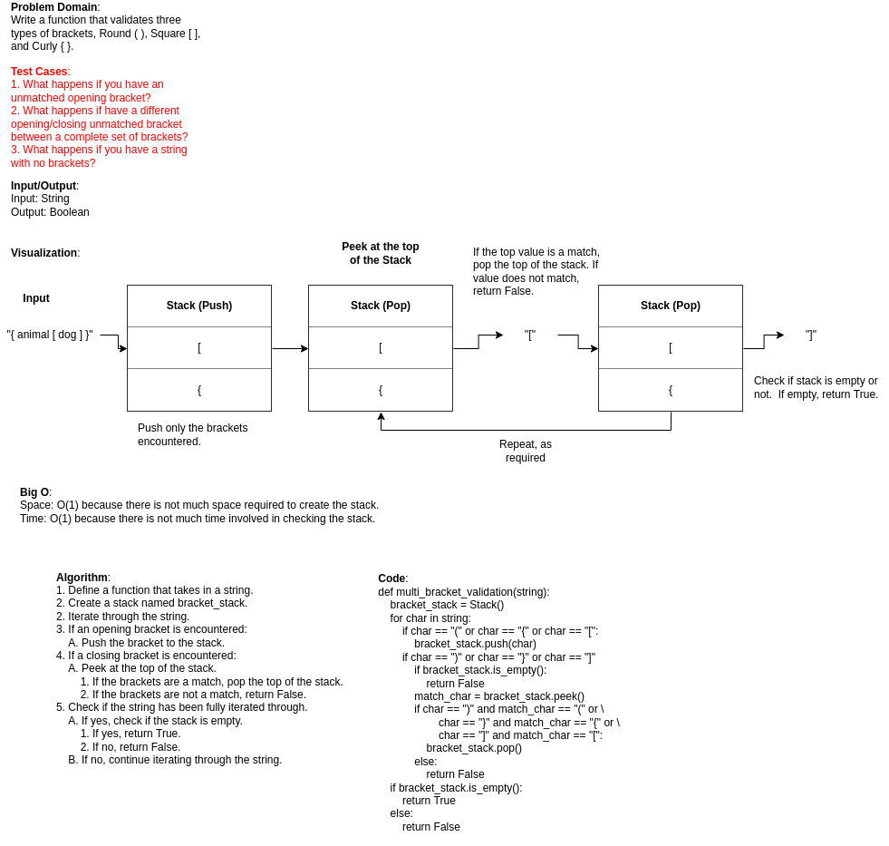

## Challenge
The challenge was to determine if brackets of type `( )`, `{ }`, and `[ ]`
were properly paired up in a string using a stack or a queue.

## Approach & Efficiency
The approach taken was to write an algorithm utilizing the previous stack.py
file that had been created with the push, pop, peek, and is_empty methods.
That file was then copied, along with the node.py and
invalid_operation_error files into the stack_queue_brackets directory.  With
the files all in the correct locations, the algorithm was then converted
into code and tested.

Big O:
* Space: O(1) because a new stack does not take up much memory to create.
* Time: O(n) because iterating over a string and performing methods on a
  stack do not take much time.

API:
multi_bracket_validation: Takes in a string and returns True if all brackets
are paired correctly and False if brackets are not paired correctly.

## Whiteboard

