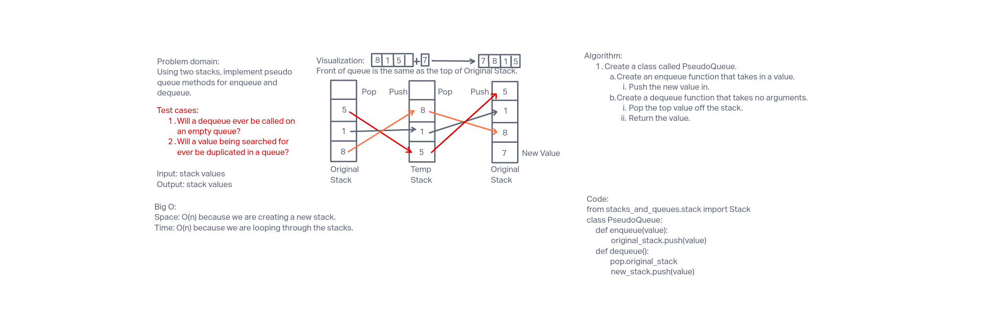

# Stacks and Queues
A stack is a data structure that consists of Nodes that are put in via FILO
(first in last out) and taken out via LIFO (last in first out).  A queue is
a data structure that also consists of Nodes, but they are put in via FIFO
(first in first out) and taken out via LILO (last in last out).

## Challenge
The challenge was to implement a new class called PseudoQueue.  This was to
simulate a queue utilizing two Stack instances.  The simulation was to have
two new methods called enqueue and dequeue which would then use a first-in,
first-out (FIFO) approach.  Methods for push, pop, and peek were available
to use from a previously created Stack implementation.

## Approach & Efficiency
The approach taken was to review each test that needed to pass individually,
then write a piece of code to pass that test.

Big O:
* Space: O(n) because we are added a new stack to simulate the queue.
* Time: O(n) because we are looping through a full stack to push a new node
  while simulating a queue.

## API
* PseudoQueue Methods:
  * __enqueue__: Pushes a new node to the top of the stack.
  * __dequeue__: Pops the top of the stack.

## Whiteboard Process

##### Worked with Sergii Otryshko
