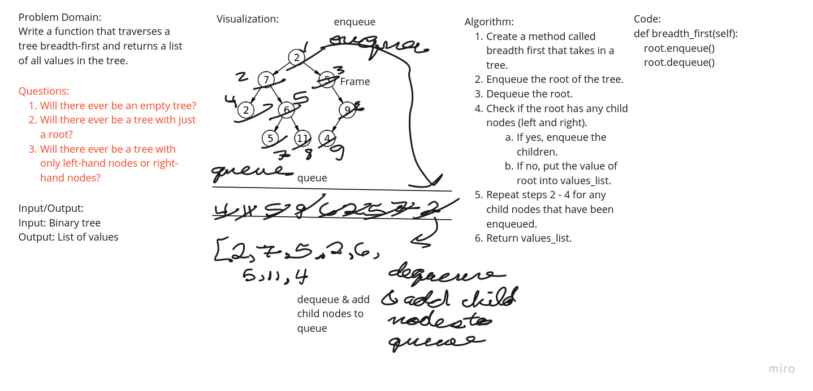

### Challenge Summary
Write a method that takes in a binary tree and returns a list of values in a
breadth-first order.

### Whiteboard Process

### Approach & Efficiency
The approach that was taken was to copy the invalid_operation_error.py,
queue.py, and trees.py files from previous projects into this project.  Then,
using a test driven development (TDD), write the code that would be needed.

Big O:
Space: TBD
Time: TBD

### Solution
N/A

##### Worked with: Jae Loney, Brendon Hampton, Brian Tarte, Pedro Perez
