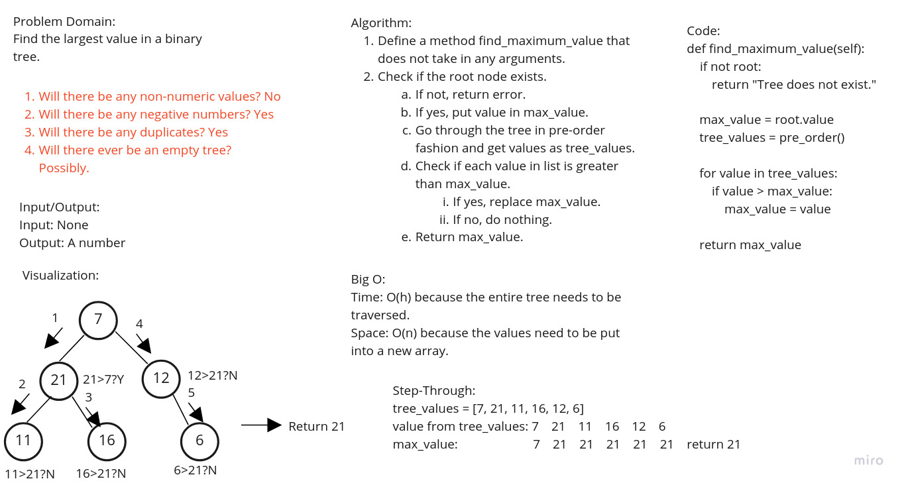

## Challenge
For this challenge, a tree should be traversed and the maximum value found
in the tree returned.

## Whiteboard Process

## Approach & Efficiency
The approach taken was to utilize the existing pre-order method that was
written in the previous code challenge to return the list of values in a
given tree.  The root value was then put into a variable called max_value.
The list of values was then iterated through and each value compared to
max_value.  If the value was greater than the max_value, then max_value was
set to the greater value.

Big O:
Time: O(n) because this is a binary tree which may need to be traversed
completely.
Space: O(n) because the list of values is creating a new data structure.

## API
__find_maximum_value__: Returns the maximum value found in a binary tree.
